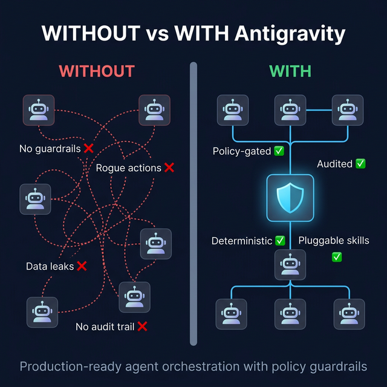
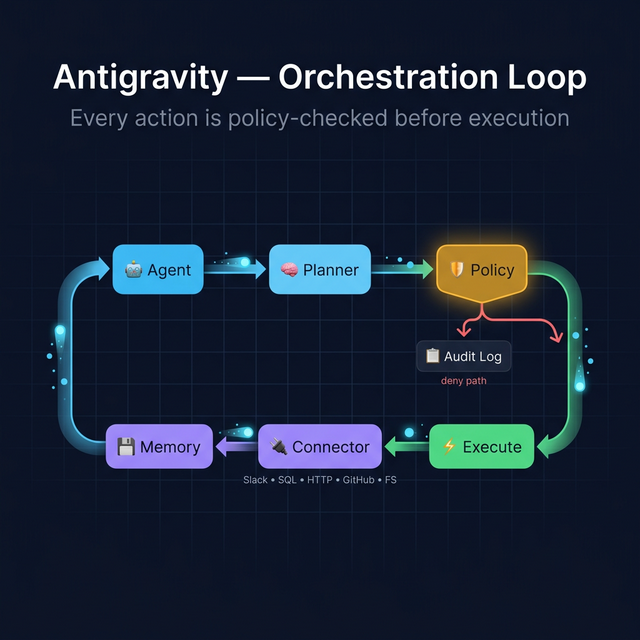
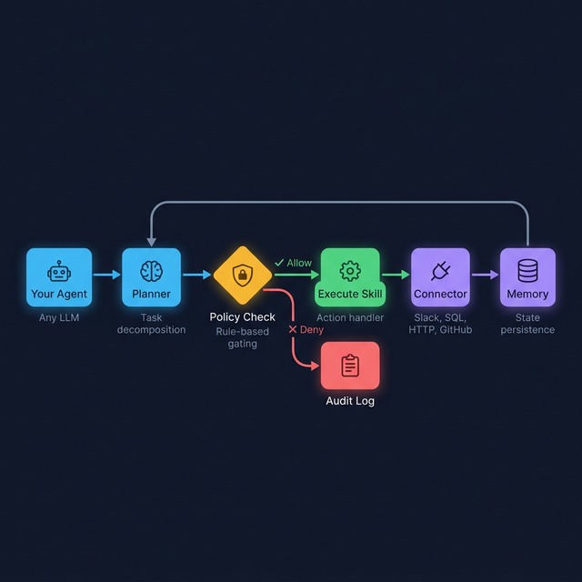

<p align="center">
  
</p>

<h1 align="center">Antigravity</h1>

<p align="center">
  <strong>Your AI agents run 50 actions a minute. One rogue delete in production and your database is gone.<br/>
  Antigravity puts a policy checkpoint before every single action — so agents stay fast but never go rogue.</strong>
</p>

<p align="center">
  <a href="https://github.com/MinhAn15/Agent-Orchestrator-driven/actions"></a>
  
  
  
</p>

---

## Try it in 30 seconds

```bash
git clone https://github.com/MinhAn15/Agent-Orchestrator-driven.git
cd Agent-Orchestrator-driven
pip install -e .
python examples/quickstart.py
```

**Expected output:**

```
ExecutionResult(
  run_id='5baf10cd-...', 
  status='completed',
  output={'message': 'Incident alert sent.', 'severity': 'high', 'service': 'billing-api'},
  error=None
)
```

The demo ran one action through the policy engine → allowed → executed → persisted to memory. All in one call.

👉 **[Full Quickstart Guide →](docs/QUICKSTART.md)**

---

## How it works

<p align="center">
  
</p>

Every request your agent makes passes through the **Policy Check** first. If allowed, it executes a **Skill**. Result goes into **Memory** so the next step has full context. If denied, the action is blocked and logged for audit.

| Component | What It Does | Key Detail |
|---|---|---|
| 🛡️ **Policy Engine** | Gates every action with declarative rules | Priority-ordered, first match wins |
| 🔌 **Connectors** | Pluggable skills: Slack, SQL, HTTP, GitHub, Filesystem | Same interface — swap without code change |
| 📋 **Templates** | Markdown workflow definitions with `{{variables}}` | 5 production-ready templates included |
| 💾 **Memory** | Scoped state persistence per workflow | In-memory, Redis, or Postgres backends |
| 🧠 **LLM Engine** | Provider abstraction for model calls | OpenAI, Ollama, or stub for CI |
| 🔄 **Runtime** | Checkpoint, handoff, retry, audit trail | Resume after crash, agent-to-agent handoff |

<p align="center">
  
</p>

---

## Use in your project

### AI-First: Tell your AI IDE

Copy-paste this into **Antigravity / Codex / Copilot / CLine / Cursor**:

```text
I want to add Antigravity agent orchestration to this project.

1. Clone: git clone https://github.com/MinhAn15/Agent-Orchestrator-driven.git
2. Install: pip install -e .
3. It provides: policy-gated agent execution, pluggable connectors (Slack/SQL/HTTP/GitHub),
   markdown workflow templates, and a deterministic runtime with checkpoint/handoff/retry.
4. Key files: see AGENTS.md for codebase map, .agents/workflows/ for step-by-step guides.
5. MCP server: python -m antigravity.cli mcp --stdio (exposes run_workflow, inspect_state, handoff tools)

Help me integrate the FixedOrchestrator into my existing service with a custom action handler.
```

### Manual integration

| Task | One-liner |
|---|---|
| Run a workflow | `antigravity run incident-response --vars '{"team":"SRE"}'` |
| Python API | `FixedOrchestrator().run("workflow-name", {"action_type": "alert"})` |
| Start MCP server | `python -m antigravity.cli mcp --stdio` |

👉 **[Full Quickstart Guide →](docs/QUICKSTART.md)**

---

## Research + License

This framework implements concepts from multi-agent orchestration research, including policy-gated execution, deterministic workflow composition, and structured agent handoff semantics.

**Key references:**

- AutoGen: Enabling Next-Gen LLM Applications (Wu et al., 2023)
- ReAct: Synergizing Reasoning and Acting in Language Models (Yao et al., 2023)

[Apache 2.0](./LICENSE) © 2026 MinhAn15
