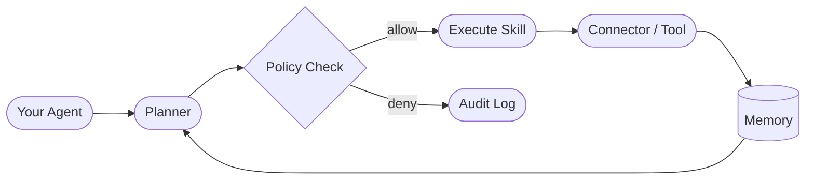

# Antigravity

> **The orchestration backbone for production AI agents.**
> Define rules. Build skills. Run deterministic workflows. Ship.

[](https://github.com/MinhAn15/Agent-Orchestrator-driven/actions)
[](./LICENSE)
[](https://www.python.org/)
[](https://github.com/MinhAn15/Agent-Orchestrator-driven/releases)

Antigravity gives your AI agents three things they're missing in production:

- 🛡️ **Rules** — every action is checked against a policy before it runs. No agent goes rogue.
- 🧠 **Skills** — reusable connectors and templates your agents pick up and use immediately.
- 🔄 **Workflows** — a structured execution loop that keeps state, routes decisions, and escalates when needed.

---

## How it works



Every request your agent makes passes through the **Policy Check** first.
If allowed, it executes a **Skill** (Slack, SQL, HTTP, filesystem, …).
Result goes into **Memory** so the next step in the workflow has full context.

---

## Get started in 3 steps

**1. Clone and install**

```bash
git clone https://github.com/MinhAn15/Agent-Orchestrator-driven.git
cd Agent-Orchestrator-driven
pip install -e .
```

**2. Copy the starter workflow**

```bash
cp templates/incident-response.md my-workflow.md
```

Open `my-workflow.md`, fill in your team name and services. That’s it — this is your first workflow definition.

**3. Run the demo**

```bash
python examples/quickstart.py
# or after install
antigravity run incident-response --payload '{"action_type":"alert","service":"billing-api"}'
```

You’ll see the policy engine evaluate a request, a skill execute, and state saved to memory — all in one loop.

---


## Why this version is stable for Antigravity users

This repository now ships an **opinionated fixed orchestrator runtime** (`FixedOrchestrator`) so teams can automate with minimal setup:

- deterministic execution path (policy check -> action handler -> persisted result)
- built-in production-safe default policy rules
- one-command CLI (`antigravity run ...`)
- one-call Python API for embedding into existing services

This keeps behavior predictable and lowers operational mistakes when shipping agent workflows to production.

---

## Core concepts

### Rules — `src/antigravity/policy.py`

Rules are plain dicts you declare, not code you write.
The engine evaluates them in priority order; first match wins.

```
Each rule has:
  id        → unique name
  condition → key/value pairs to match on the request context
  effect    → allow | deny | require_approval
  priority  → lower number = checked first
  reason    → shown in the audit log
```

Built-in defaults block deletes in production and require approval for financial actions.
Add your own rules in a YAML/JSON file and load them at startup — no code change needed.

---

### Skills — `connectors/`

Skills are pre-built connectors your agents can call.

| Skill | What it does |
|---|---|
| `SlackConnector` | Send alerts with severity levels (info / warning / error) |
| `SQLConnector` | Query any database (SQLite, Postgres, MySQL) |
| `HTTPConnector` | Call any REST API |
| `FileSystemConnector` | Read / write local files |
| `GitHubConnector` | Open issues, post comments, create PRs |

All skills follow the same interface — swap one for another without changing your workflow.

---

### Workflows — `templates/`

Workflows are Markdown files that describe a repeatable agent process.
Variables like `{{team}}`, `{{severity}}`, `{{service}}` get filled in at runtime.

Ready-made templates:

| Template | Use case |
|---|---|
| `incident-response.md` | Detect → diagnose → remediate → notify |
| `bug-triage.md` | Classify → assign → track |
| `customer-support.md` | Classify intent → retrieve docs → reply or escalate |
| `content-ops.md` | Research → draft → review → publish |
| `lead-enrichment.md` | Fetch data → score → sync to CRM |

To use a template, load it and fill in your variables:

```bash
# List available templates
python -c "from templates.gallery import get_gallery; [print(t.name, '-', t.description) for t in get_gallery().list_all()]"
```

---

### Memory — `src/antigravity/memory.py`

State is scoped to a **namespace** (your workflow) and a **key** (the object).
No two workflows ever touch each other’s state.

| Backend | When to use |
|---|---|
| `memory` | Local dev and unit tests |
| `redis` | Single-node production |
| `postgres` | Durable, queryable state |

Swap backends in one line — zero code change in your workflow.

---

### LLM Engine — `src/llm_policy.py`

Your workflow calls the LLM through a provider abstraction.
Switch models or vendors without touching workflow logic.

| Provider | When to use |
|---|---|
| `openai` | Production (GPT-4o, GPT-4o-mini, …) |
| `ollama` | Local / air-gapped / private data |
| `stub` | CI, unit tests, offline demos |

---

## Project layout

```
.
├── templates/     ← start here: your workflow definitions
├── src/           ← rules (policy) + memory + LLM engine
├── connectors/    ← skills: Slack, SQL, HTTP, GitHub, filesystem
├── examples/      ← runnable demos
├── benchmarks/    ← performance baselines
└── tests/         ← full test suite (run with pytest)
```

---

## Use cases

> Figures below are targets based on internal prototypes. Reproducible benchmarks: [`benchmarks/`](./benchmarks/).

**Support automation** — triage, route, and resolve tickets with policy guardrails.

**Incident response** — detect anomalies, fan out diagnostics, propose runbooks.

**Growth ops** — coordinate campaign planning, copy generation, QA, and launch.

---

## Contributing

- **Bug reports** → [Open an issue](https://github.com/MinhAn15/Agent-Orchestrator-driven/issues)
- **Feature requests** → [Start a discussion](https://github.com/MinhAn15/Agent-Orchestrator-driven/discussions)
- **Pull requests** → See [CONTRIBUTING.md](./CONTRIBUTING.md)

---

## License

[Apache 2.0](./LICENSE) © 2026 MinhAn15
