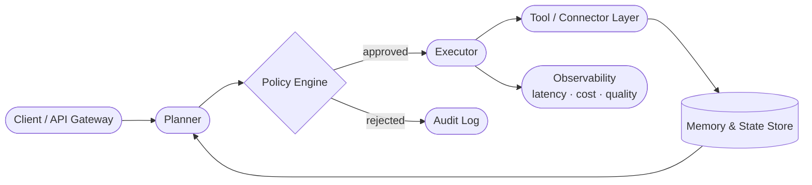

# Antigravity

> **Open-source agent orchestration for production multi-agent systems**

[](https://github.com/MinhAn15/Agent-Orchestrator-driven/actions)
[](./LICENSE)
[](https://www.python.org/)
[](https://github.com/MinhAn15/Agent-Orchestrator-driven/releases)
[](./CONTRIBUTING.md)

Antigravity is an open-source orchestration backbone for production-grade multi-agent systems — providing policy enforcement, stateful memory, and unified observability across any LLM provider.

---

## Architecture



---

## Why Antigravity?

Most AI agent stacks are disconnected scripts — they work in demos but break under real production load. Antigravity solves this with:

- **Policy-aware execution** — enforce guardrails, human-in-the-loop approvals, and access controls before any tool is called.
- **Stateful memory** — workflows retain context across runs, restarts, and agent handoffs.
- **Unified observability** — track latency, token cost, and output quality in one place.
- **Composable connectors** — plug agents into your existing business systems (CRM, ticketing, data warehouses).

---

## Use Cases

> **Note:** The figures below are illustrative targets based on internal prototypes, not externally validated benchmarks. Reproducible benchmarks are in progress — see [`benchmarks/`](./benchmarks/).

### 1. Support Automation
Automatically triage, route, and resolve repetitive tickets with policy checks and escalation logic.
- Target: reduce first-response time and ticket deflection rate
- Example: [`examples/support_automation/`](./examples/)

### 2. Growth Operations
Coordinate campaign planning, copy generation, QA, and launch workflows across agents.
- Target: faster experiment velocity, reduced manual ops overhead
- Example: [`examples/growth_ops/`](./examples/)

### 3. Incident Response
Detect anomalies, fan out diagnostics, and propose remediation runbooks automatically.
- Target: lower Mean Time to Acknowledge (MTTA) and Mean Time to Resolve (MTTR)
- Example: [`examples/incident_response/`](./examples/)

---

## Quickstart

### Prerequisites

- Python 3.10+
- Docker & Docker Compose v2
- An LLM API key (OpenAI, Anthropic, or compatible)

### Steps

**1. Clone the repository**

```bash
git clone https://github.com/MinhAn15/Agent-Orchestrator-driven.git
cd Agent-Orchestrator-driven
```

**2. Configure environment**

```bash
cp .env.example .env
# Edit .env: set LLM_API_KEY and any connector credentials
```

**3. Start the orchestrator**

```bash
docker compose up -d
# Alternative: make dev
```

**4. Trigger a demo workflow**

```bash
curl -X POST http://localhost:8080/workflows/demo/run \
  -H "Content-Type: application/json" \
  -d '{"input": "run support automation sample"}'
```

**5. View dashboard & traces**

Open [http://localhost:3000](http://localhost:3000) to see the workflow execution graph, latency metrics, and policy audit trail.

---

## Project Structure

```
.
├── src/               # Core orchestration engine (planner, executor, policy)
├── runtime/           # Agentic runtime modules and semantics
├── connectors/        # Connector SDK + sample integrations
├── benchmarks/        # Reproducible benchmark suite
├── examples/          # End-to-end workflow examples
├── templates/         # Reusable workflow templates
├── docs/              # MkDocs documentation source
└── tests/             # Unit and integration tests
```

---

## Roadmap

| Milestone | Target Version | Status |
|-----------|---------------|--------|
| Core planner + executor | v0.1 | ✅ Done |
| Policy engine (rule-based) | v0.2 | 🔄 In progress |
| Memory backends (Redis, Postgres) | v0.2 | 🔄 In progress |
| Connector SDK + 5 built-in connectors | v0.3 | 📋 Planned |
| Public reproducible benchmark suite | v0.3 | 📋 Planned |
| LLM-native adaptive policy engine | v0.4 | 📋 Planned |
| Template gallery + community contributions | v0.5 | 📋 Planned |
| Stable v1.0 release | v1.0 | 📋 Planned |

---

## Contributing

Contributions are very welcome! Please read [CONTRIBUTING.md](./CONTRIBUTING.md) before submitting.

- **Bug reports** → [Open an issue](https://github.com/MinhAn15/Agent-Orchestrator-driven/issues)
- **Feature requests** → [Start a discussion](https://github.com/MinhAn15/Agent-Orchestrator-driven/discussions)
- **Pull requests** → Follow the PR template in [`.github/`](./.github/)

---

## License

[Apache 2.0](./LICENSE) © 2026 MinhAn15
